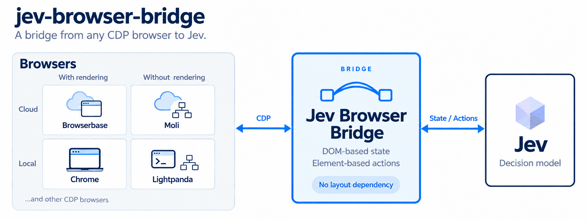

# Jev NoLayout

## Plug **any** browser into Jev.

[](LICENSE)
[](pyproject.toml)
[](#results)

**Cloud, local or self-hosted. Chromium or not. Even browsers that never draw a page.**
If it speaks CDP, it runs Jev.

<p align="center">
  
</p>

## Results

Same agent, same five goals on every browser.

| Browser | Kind | Draws pages? | Pass rate | Avg. steps |
| --- | --- | :-: | :-: | :-: |
| **[Moli](https://browser.lexmount.com)** (Lexmount) | Cloud | No | **10/10** | 2.2 |
| [Cloudflare Kitesurf](https://developers.cloudflare.com/browser-run/kitesurf/) | Cloud | Own engine | **10/10** | 2.2 |
| [Browserbase](https://www.browserbase.com) | Cloud | Yes | **10/10** | 2.2 |
| Cloudflare Browser Run (Chromium) | Cloud | Yes | **7/7** | 2.1 |
| Chrome · chrome-headless-shell · Playwright Chromium | Local | Yes | **10/10** each | 2.2 |
| [Lightpanda](https://lightpanda.io) | Local | No | **9/10** | 2.2 |
| [Obscura](https://github.com/h4ckf0r0day/obscura) (no-render build) | Local | No | **9/10** | 2.3 |
| browserless · Steel · chromedp · Kernel | Self-hosted | Yes | **10/10** each | 2.2 |
| Selenium Grid | Self-hosted | Yes | **5/5** | 2.2 |

## Plug in a browser

**Moli**, a cloud browser from Lexmount:

```python
from jev_nolayout import Agent, lexmount_session

with lexmount_session() as browser:
    browser.navigate("https://en.wikipedia.org/wiki/Espresso")
    for state in Agent(browser, "Open the article about Latte").run():
        print(state.steps[-1])
```

**Lightpanda**, a headless browser running on your machine:

```bash
lightpanda serve --port 9222
```

```python
from jev_nolayout import Agent, connect

with connect("http://127.0.0.1:9222") as browser:
    browser.navigate("https://en.wikipedia.org/wiki/Espresso")
    for state in Agent(browser, "Open the article about Latte").run():
        print(state.steps[-1])
```

Any other browser works the same way: pass its CDP address to `connect()`.

## How it works

Most browser-agent frameworks decide what is on a page by asking the **layout engine**. Jev NoLayout asks the **DOM**.

| | Position-based reader | Jev NoLayout |
| --- | --- | --- |
| Is this control live? | `checkVisibility()` | `hidden`, `inert`, `aria-hidden`, `disabled` |
| Can the agent reach it? | inside the viewport, by `getBoundingClientRect()` | anywhere in the document |
| What does the page say? | text ranges on screen | every row, retrieved against the goal |
| How is it clicked? | a mouse event at (x, y) | dispatched on the element |

On Chrome both work. On a browser whose layout is lazy, missing or fake, only one of them does — same page, controls / characters read:

| Browser | Position-based | Jev NoLayout |
| --- | --- | --- |
| Moli · Google Flights | **5 / 7** | 155 / 34,189 |
| Lightpanda · Wikipedia | **18 / 221** | 2,875 / 137,723 |
| Obscura · Wikipedia | **250 / 6,000** — every box is a placeholder, so everything is "on screen" | 2,876 / 137,745 |
| Kitesurf · Google Flights | **error** — no `checkVisibility` | 209 / 36,569 |

## Why it matters

- **One integration, every browser.** Cloud, local, self-hosted, Chromium or not. Adding a browser is a URL, not an adapter.
- **The whole page, not the screen.** A control below the fold is a candidate like any other, so the agent does not scroll around looking for it. That is why the average stays near two steps.
- **The same read on every Chromium.** 2,876 controls on the Jupiter article in local Chrome, in headless-shell, in every hosted service tested — no dependence on window size.
- **Clicks cannot miss.** An action is dispatched on the element it was offered for; there is no coordinate to go stale between reading the page and acting on it.
- **Cheaper browsers become usable.** Engines that skip rendering — Moli, Lightpanda — are faster and lighter to run, and the reading method most agents rely on breaks on exactly them.

## Try it

```bash
git clone https://github.com/lexmount/jev-nolayout.git
cd jev-nolayout
uv sync --extra lexmount
cp .env.example .env          # JEV_API_KEY, and Lexmount credentials for Moli

uv run jev-nolayout https://en.wikipedia.org/wiki/Espresso "Open the article about Latte"
```

```text
  goal     Open the article about Latte
  from     https://en.wikipedia.org/wiki/Espresso
  browser  Moli

   1. CLICK      caffè latte
       3690 ms   decision 1428 ms   703 actions offered
      clicked
   2. DONE
        805 ms   decision 804 ms   282 actions offered
      done

  done  ·  2 steps  ·  4.5s
  https://en.wikipedia.org/wiki/Latte
```

Any other browser: `--cdp http://127.0.0.1:9222` (or a `ws://` URL). A text model (`TEXT_MODEL_API_KEY`) is only needed for goals that type into a field.

## Under the hood

<details>
<summary><b>One decision request per step</b></summary>

Each observation becomes an element table; Jev chooses the operation (`CLICK`, `TYPE_TEXT`, `SELECT`, `WAIT`, `DONE`, `BLOCKED`) and, in the same request, the target for each operation. Only the target matching the chosen operation is used. Only observed elements are ever offered, so the model cannot name one that does not exist. A small text model writes a string only when the operation is `TYPE_TEXT`.

</details>

<details>
<summary><b>Controls that share a name</b></summary>

Reading the whole page surfaces every control with a given name, not just the one on screen. Google's date picker has four buttons that all read `Done`, and only one commits the date — so same-named controls are labelled by where they live (`Done · date picker`, `Done · 2 of 3`). Links that share a name *and* a destination are one control repeated, and are offered once.

</details>

<details>
<summary><b>Page text is retrieved, not truncated</b></summary>

A long article is 50,000–150,000 characters, and the first few thousand are navigation. The page is split into rows (a table row stays one row, `Elevation | 8,848.86 m`) and the rows that bear on the goal are kept, in page order, up to `JEV_EVIDENCE_CHARS` (default 20,000). On four long articles a 6,000-character prefix missed the answer every time; retrieval kept it every time.

</details>

<details>
<summary><b>Pages that change under the agent</b></summary>

A link or a submit button waits for the next document before the page is read again. A link that opens on a new page target is followed there. A field the page replaces after it is typed into is found and filled again. Each step reads the page once.

</details>

`examples/quickstart.py` is the shortest complete run. `examples/flights.py` drives a live Google Flights search and checks the result against the page itself, not against the model's claim of success.

## License

Apache 2.0
