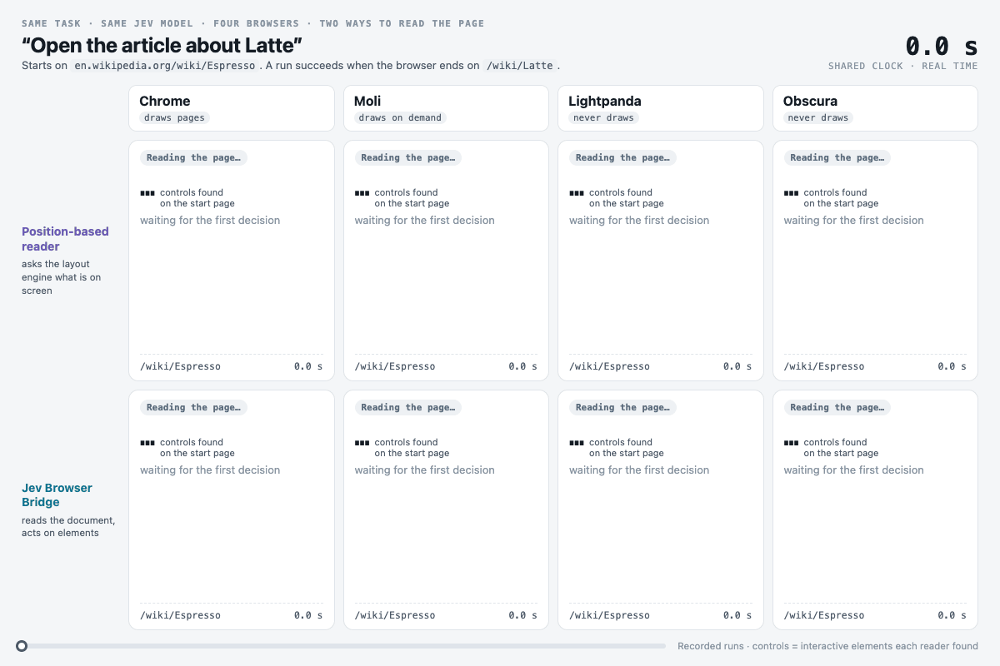
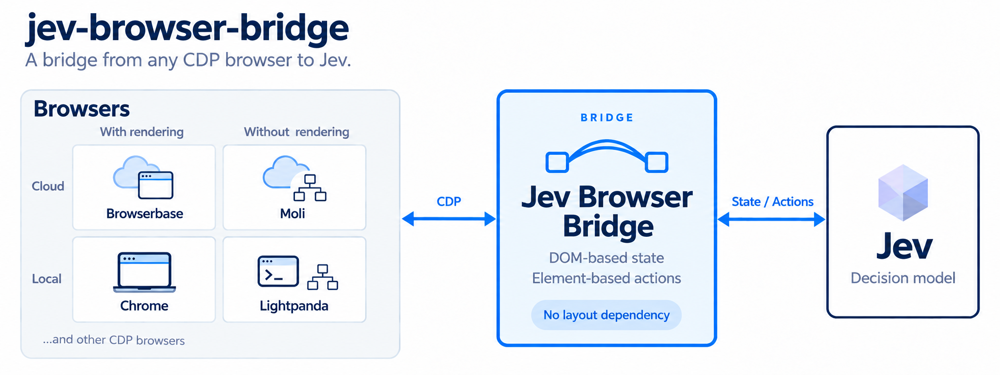

# Jev Browser Bridge

## Plug **any** browser into Jev.

[](LICENSE)
[](pyproject.toml)
[](#results)

**Cloud, local or self-hosted. Chromium or not. Even browsers that never draw a page.**
If it speaks CDP, it runs Jev.

<p align="center">
  <a href="https://lexmount.github.io/jev-browser-bridge/assets/demo/">
    
  </a>
</p>
<p align="center">
  One task, one Jev model, four browsers, each read two ways — recorded runs on a shared clock. Pictures are each browser's own screenshot; Lightpanda answers with a placeholder and Obscura has no screenshot at all. The position-based reader finishes on the browsers that draw pages; <b>Jev Browser Bridge finishes on all four</b>. <a href="https://lexmount.github.io/jev-browser-bridge/assets/demo/">Open the player</a> to pause, scrub and read each run's raw trace.
</p>

<p align="center">
  
</p>

## Results

**Jev on [MiniWoB++](https://miniwob.farama.org), one agent, every browser.** 86 tasks × 2 seeds = 172 episodes per browser. Each episode is seeded, so every browser gets the same problems, and each page grades itself. Same decision model, same text model; only the browser changes.

| Browser | Kind | Draws pages? | Jev Browser Bridge | Position-based reader |
| --- | --- | :-: | :-: | :-: |
| Chrome | Local | Yes | **106/172** (62%) | 54/172 (31%) |
| [Browserbase](https://www.browserbase.com) | Cloud | Yes | **112/172** (65%) | — |
| Cloudflare Browser Run (Chromium) | Cloud | Yes | **102/172** (59%) | — |
| **[Moli](https://browser.lexmount.com)** (Lexmount) | Cloud | On demand | **105/172** (61%) | 42/172 (24%) |
| [Cloudflare Kitesurf](https://developers.cloudflare.com/browser-run/kitesurf/) | Cloud | Own engine | **112/172** (65%) | — |
| [Lightpanda](https://lightpanda.io) | Local | No | **110/172** (64%) | 52/172 (30%) |
| [Obscura](https://github.com/h4ckf0r0day/obscura) | Local | No | **30/172** (17%) | 0/172 (0%) |

The bridge scores the same on a browser that draws pages, one that draws them on demand and one that never does. Obscura is lower because its script engine does not run many of the task pages at all: 18 of the 86 never start. Kitesurf has no `Math.seedrandom`, so its episodes are fresh problems from the same tasks rather than the seeded ones. The 44 MiniWoB++ tasks left out need a pointer position, a drag, a drawing, a colour or a password — see [`benchmarks/miniwob/excluded.tsv`](benchmarks/miniwob/excluded.tsv). Run it yourself with [`benchmarks/miniwob/run.py`](benchmarks/miniwob/run.py).

Also connects and completes live-site tasks: chrome-headless-shell, Playwright Chromium, browserless, Steel, chromedp, Kernel and Selenium Grid.

## Plug in a browser

**Moli**, a cloud browser from Lexmount:

```python
from jev_browser_bridge import Agent, lexmount_session

with lexmount_session() as browser:
    browser.navigate("https://en.wikipedia.org/wiki/Espresso")
    for state in Agent(browser, "Open the article about Latte").run():
        print(state.steps[-1])
```

**Lightpanda**, a headless browser running on your machine:

```bash
lightpanda serve --port 9222
```

```python
from jev_browser_bridge import Agent, connect

with connect("http://127.0.0.1:9222") as browser:
    browser.navigate("https://en.wikipedia.org/wiki/Espresso")
    for state in Agent(browser, "Open the article about Latte").run():
        print(state.steps[-1])
```

Any other browser works the same way: pass its CDP address to `connect()`.

## How it works

Most browser-agent frameworks decide what is on a page by asking the **layout engine**. Jev Browser Bridge asks the **DOM**.

| | Position-based reader | Jev Browser Bridge |
| --- | --- | --- |
| Is this control live? | `checkVisibility()` | `hidden`, `inert`, `aria-hidden`, `disabled` |
| Can the agent reach it? | inside the viewport, by `getBoundingClientRect()` | anywhere in the document |
| What does the page say? | text ranges on screen | every row, retrieved against the goal |
| How is it clicked? | a mouse event at (x, y) | dispatched on the element |

On Chrome both work: the position-based reader sees one screenful, by design. On a browser whose layout is lazy, missing or fake, that screenful shrinks to nothing. Controls each reader finds on the same page:

| Browser | Wikipedia article: position-based | Wikipedia article: Jev Browser Bridge | Google Flights: position-based | Google Flights: Jev Browser Bridge |
| --- | :-: | :-: | :-: | :-: |
| Chrome (reference) | 51 | 704 | 24 | 150 |
| Moli | 68 | 703 | **5** | 157 |
| Lightpanda | **17** | 704 | page does not start | page does not start |
| Obscura | **0** | 1,219 | **0** | 184 |
| Kitesurf | **error** (no `checkVisibility`) | 1,031 | **error** | 209 |

## Why it matters

- **One integration, every browser.** Cloud, local, self-hosted, Chromium or not. Adding a browser is a URL, not an adapter.
- **The whole page, not the screen.** A control below the fold is a candidate like any other, so the agent does not scroll around looking for it.
- **The same read on every Chromium.** 2,876 controls on the Jupiter article in local Chrome, in headless-shell, in every hosted service tested — no dependence on window size.
- **Clicks cannot miss.** An action is dispatched on the element it was offered for; there is no coordinate to go stale between reading the page and acting on it.
- **Cheaper browsers become usable.** Engines that render lazily or not at all — Moli, Lightpanda — are faster and lighter to run, and the reading method most agents rely on breaks on exactly them.

## Try it

```bash
git clone https://github.com/lexmount/jev-browser-bridge.git
cd jev-browser-bridge
uv sync --extra lexmount
cp .env.example .env          # JEV_API_KEY, and Lexmount credentials for Moli

uv run jev-browser-bridge https://en.wikipedia.org/wiki/Espresso "Open the article about Latte"
```

```text
  goal     Open the article about Latte
  from     https://en.wikipedia.org/wiki/Espresso
  browser  Moli

   1. CLICK      caffè latte
       3690 ms   decision 1428 ms   703 actions offered
      clicked
   2. DONE
        805 ms   decision 804 ms   282 actions offered
      done

  done  ·  2 steps  ·  4.5s
  https://en.wikipedia.org/wiki/Latte
```

Any other browser: `--cdp http://127.0.0.1:9222` (or a `ws://` URL). A text model (`TEXT_MODEL_API_KEY`) is only needed for goals that type into a field.

## Under the hood

<details>
<summary><b>One decision request per step</b></summary>

Each observation becomes an element table; Jev chooses the operation (`CLICK`, `TYPE_TEXT`, `SELECT`, `WAIT`, `DONE`, `BLOCKED`) and, in the same request, the target for each operation. Only the target matching the chosen operation is used. Only observed elements are ever offered, so the model cannot name one that does not exist. A small text model writes a string only when the operation is `TYPE_TEXT`.

</details>

<details>
<summary><b>Controls that share a name</b></summary>

Reading the whole page surfaces every control with a given name, not just the one on screen. Google's date picker has four buttons that all read `Done`, and only one commits the date — so same-named controls are labelled by where they live (`Done · date picker`, `Done · 2 of 3`). Links that share a name *and* a destination are one control repeated, and are offered once.

</details>

<details>
<summary><b>Controls the markup does not announce</b></summary>

A `<span>` with a click handler bound by script has no role, no `href` and no `onclick` attribute. The page's stylesheet usually still says `cursor: pointer`, so those rules are read — as selector text, not as rendering — and the elements they name are offered; an engine with no CSS object model has its `<style>` text parsed instead. A clickable list is offered item by item, and a field with no label is named by the text beside it. These came out of MiniWoB++, where links, menus and icons are all such spans.

</details>

<details>
<summary><b>Page text is retrieved, not truncated</b></summary>

A long article is 50,000–150,000 characters, and the first few thousand are navigation. The page is split into rows (a table row stays one row, `Elevation | 8,848.86 m`) and the rows that bear on the goal are kept, in page order, up to `JEV_EVIDENCE_CHARS` (default 20,000). On four long articles a 6,000-character prefix missed the answer every time; retrieval kept it every time.

</details>

<details>
<summary><b>Pages that change under the agent</b></summary>

A link or a submit button waits for the next document before the page is read again. A link that opens on a new page target is followed there. A field the page replaces after it is typed into is found and filled again. Each step reads the page once.

</details>

`uv run pytest` runs the offline checks — retrieval, connection handling and retries — with no browser or API key. `examples/quickstart.py` is the shortest complete run. `examples/flights.py` drives a live Google Flights search and checks the result against the page itself, not against the model's claim of success.

## License

Apache 2.0
